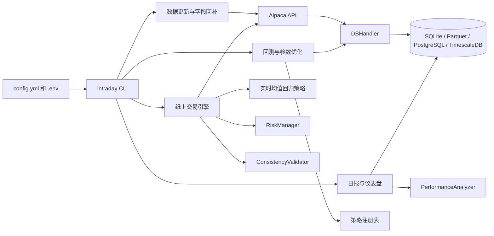

# Intraday Trader Air

Intraday Trader Air 是一个基于 Python 3.10 的日内量化交易项目，覆盖策略开发、历史回测、Alpaca 纸上交易接入，以及行情、交易记录和绩效数据的本地与数据库存储。

项目当前包含 Backtrader 回测框架、三类内置策略加买入持有基准、风险检查、绩效分析、数据质量检查、Streamlit 仪表盘、Docker 与 Docker Compose 运行入口。

交易相关代码会直接影响资金安全。实盘前请先在 Alpaca Paper Trading 或等价模拟环境中验证策略、风控、订单状态同步和异常处理。日内交易还可能受到最低净值、行情源、券商风控、订单撤改单比例和监管要求影响。代码通过测试只说明程序路径可运行，不能说明策略会赚钱。

## 当前功能范围

### 策略与回测

- 回测框架使用 Backtrader，统一入口位于 `intraday_trader_air.backtest.engine`。
- 内置策略包括 `MeanReversionZScoreStrategy`、`EMACrossoverStrategy`、`CustomRatioStrategy` 和 `BuyAndHoldStrategy`。
- `mean_reversion` 支持滚动 Z-Score、可选 `filtered_close` 输入和限价单参数。
- `ema_crossover` 使用 EMA 交叉、ADX 过滤和移动止损参数。
- `custom_ratio` 使用价格与长期均线的比值生成多空信号。
- 回测输出包括最终资产、交易次数、胜率、净利润、夏普比率、最大回撤、年化收益、VaR、CVaR 和换手率。
- 基准策略支持价格收益，也支持在 Alpaca 可返回股息数据时计算含股息总回报。
- 参数优化读取 `config.yml` 中的 `strategies.*.opt_ranges`，并按 `backtest.max_cpus` 控制并行度。

### 数据与存储

- 行情数据通过 Alpaca API 拉取，默认标的、时间窗口和复权方式在 `config.yml` 的 `data` 段配置。
- `fetch_historical_data` 会优先读取数据库和缓存，缺失时再请求 API，并把结果写回缓存或数据库。
- `DBHandler` 支持 `sqlite`、`parquet` 和 `postgresql` 三类后端。使用 PostgreSQL 时会尝试创建 TimescaleDB hypertable。
- `market_data` 表支持 `trade_count` 与 `vwap` 字段。旧缓存缺字段时，回测可自动降级估算，也可设置 `data.require_full_fields: true` 强制报错。
- `intraday data backfill` 用来回补 `trade_count` 和 `vwap` 等字段。
- `update-data` 会拉取配置标的在前一日的分钟线，并生成数据质量报告。
- 数据质量检查覆盖时间戳顺序、重复时间戳、缺失 bar、空值和异常价格跳变。

### 实盘联调与仪表盘

- `intraday live` 启动 `EnhancedTradingSystem`，通过 `BrokerAPIHandler` 连接 Alpaca REST 与 WebSocket。
- 实盘事件流以 `asyncio.Queue` 为中心，处理 trade、bar 和订单状态更新。
- 下单前会调用 `RiskManager` 检查流动性、点差、市场冲击、杠杆和敞口。
- `ConsistencyValidator` 提供回测与实盘信号、成交和绩效的一致性检查工具。
- `no_fill_test_mode` 可以发出远离市场价格的测试单，并自动撤单，用于验证订单状态流。
- `intraday dashboard` 启动 Streamlit 仪表盘，从数据库读取交易日志和绩效快照。

### 当前已知局限

- `intraday live` 的命令行入口目前没有创建并传入 `DBHandler`，所以实时交易默认主要依赖日志。若要把实盘快照直接写入数据库，需要把数据库句柄接入 `run_trading_session()`。
- `EnhancedTradingSystem.stop_trading()` 当前调用了尚未实现的 `generate_comprehensive_report()`，停止流程中的最终报告生成还需要补齐。
- `start_live_trading()` 中存在重复的初始账户与持仓刷新逻辑，功能上影响不大，但后续应清理。
- Docker 的 `live` profile 会同时启动 TimescaleDB 和交易容器。数据库已经可供数据更新、报表和仪表盘使用，实盘入口的自动落库还需要继续打通。
- 项目目前主要围绕单标的策略展开，多标的组合、交易所撮合延迟、订单簿深度、真实交易费用和断路器等细节尚未完整建模。

## 架构总览



## 快速开始

### 环境要求

- Python 版本应为 3.10。`pyproject.toml` 明确限制为 `>=3.10,<3.11`。
- 推荐使用 `uv` 管理环境，也可以用标准库 `venv` 加 `pip`。
- 使用 Alpaca 相关命令前，需要准备 `APCA_API_KEY_ID`、`APCA_API_SECRET_KEY` 和 `ALPACA_BASE_URL`。

### 本地安装

```bash
uv venv
source .venv/bin/activate
uv sync
uv pip install -e .
```

如果只安装运行时依赖，可以使用：

```bash
UV_NO_DEV=1 uv sync --frozen
uv pip install -e .
```

`uv` 默认会使用项目目录下的 `.venv`。需要复用当前 shell 已激活的环境时，可以给 `uv` 命令加 `--active`。

### 配置密钥

```bash
cp .env.example .env
```

然后在 `.env` 中填写 Alpaca 密钥。若使用 Docker Compose 的数据库服务，还需要填写 `POSTGRES_PASSWORD`。

```bash
APCA_API_KEY_ID=replace-with-your-apca-api-key-id
APCA_API_SECRET_KEY=replace-with-your-apca-api-secret-key
ALPACA_BASE_URL=https://paper-api.alpaca.markets
POSTGRES_PASSWORD=replace-with-a-strong-local-password
```

### 常用命令

```bash
intraday update-data
intraday data backfill --fields trade_count,vwap
intraday backtest run
intraday backtest run --strategy ema_crossover
intraday backtest run --strategy mean_reversion --strategy custom_ratio
intraday backtest run --no-benchmark
intraday backtest optimise
intraday backtest optimize
intraday backtest benchmark
intraday generate-report
intraday live
intraday dashboard
```

`optimise` 和 `optimize` 都可以使用，二者指向同一个参数优化入口。旧脚本入口仍然保留，例如 `run-backtest`、`run-live`、`run-update-data`、`run-generate-report` 和 `run-dashboard`。新文档统一推荐使用 `intraday` 顶层命令。

### Docker 运行

```bash
cp .env.example .env
# 填写 .env 中的 Alpaca 密钥和 POSTGRES_PASSWORD

docker compose --profile live up trading-bot
```

只启动数据库：

```bash
docker compose --profile db up db
```

停止服务可以使用 `CTRL+C`，清理容器与网络可以使用：

```bash
docker compose down
```

## Makefile 快捷命令

```bash
make help
make sync
make backtest ARGS='--strategy ema_crossover'
make optimise ARGS='--strategy mean_reversion'
make benchmark
make update
make live
make dashboard
make lint
make fmt
make coverage
make docker-build
make docker-live
make docker-db
```

如需使用当前已激活的虚拟环境运行 `make` 目标，可以追加 `USE_ACTIVE=1`：

```bash
make backtest USE_ACTIVE=1 ARGS='--strategy ema_crossover'
```

## CLI 命令说明

| 命令 | 用途 | 主要产出 |
| --- | --- | --- |
| `intraday update-data` | 拉取配置标的前一日分钟线，写入缓存和数据库，并运行数据质量检查。 | `output/cache/`、`output/data_qc_*.json`、数据库行情表 |
| `intraday data backfill` | 按配置日期范围或命令行参数，回补 `trade_count`、`vwap` 等行情字段。 | 更新后的 `market_data` |
| `intraday backtest run` | 运行买入持有基准和选定策略的单次回测。 | 控制台指标、`output/logs/`、`output/charts/` |
| `intraday backtest optimise` | 按 `opt_ranges` 搜索策略参数。 | 控制台前十名参数组合和日志 |
| `intraday backtest benchmark` | 只运行配置中的买入持有基准。 | 基准指标和图表 |
| `intraday generate-report` | 汇总最近 24 小时的交易日志和绩效快照。 | `output/daily_report_YYYYMMDD.json` |
| `intraday live` | 启动 Alpaca 纸上交易事件循环。 | 实时日志和订单状态处理 |
| `intraday dashboard` | 启动 Streamlit 仪表盘。 | 默认本地 Web 页面：<http://localhost:8501> |

## 配置文件要点

`config.yml` 是主要配置入口：

- `alpaca`：从环境变量读取 API 密钥和接口地址。
- `data`：设置标的、回测时间范围、K 线周期、复权方式和字段完整性要求。
- `paths`：设置输出、日志、图表和缓存目录。
- `benchmark`：设置买入持有基准和股息总回报开关。
- `database`：设置 `sqlite`、`parquet` 或 `postgresql` 后端。
- `backtest`：设置初始资金、佣金、滑点和最大 CPU 数。
- `strategies`：设置策略类、参数、优化网格和订单参数。
- `live_trading`：设置纸上交易标的、初始资金、no-fill 测试和风控阈值。
- `logging`：设置日志等级、格式和时间格式。

环境变量支持 `${ENV_VAR:-default}` 形式。通用配置加载器 `intraday_trader_air.configuration.load_app_config()` 已支持默认值替换。需要注意，`run_live_trading.py` 内部还有一个旧版 YAML 加载函数，默认值替换能力较弱，后续最好统一到通用配置加载器。

## 风控参数

`config.yml` 的 `live_trading.risk_limits` 定义下单前的限制：

| 参数 | 含义 | 默认值 |
| --- | --- | --- |
| `max_order_participation_ratio` | 单笔订单占近期成交量的上限。 | 0.02 |
| `max_bid_ask_spread_pct` | 可接受的最大买卖价差比例。 | 0.005 |
| `market_impact_coefficient` | 估算市场冲击成本的系数。 | 0.5 |
| `max_gross_exposure` | 多空绝对敞口相对净值的上限。 | 1.5 |
| `max_leverage` | 总资产相对净资产的最大倍数。 | 2.0 |
| `max_var` | VaR 上限。 | 0.05 |
| `max_concentration` | 单标的集中度上限。 | 0.3 |
| `min_liquidity` | 最低流动性门槛。 | 1,000,000 |

基本流程：行情进入 `RiskManager.update_market_data()` 后，系统会检查价格跳变、成交量异常和流动性风险。下单前再调用 `check_liquidity_and_impact()` 与 `check_leverage_and_exposure()`，超限时阻止订单继续执行。

## 测试

完整测试环境应先执行：

```bash
uv sync
uv pip install -e .
```

常用测试命令：

```bash
uv run pytest
uv run pytest -m 'not integration'
uv run pytest -m integration
make coverage
```

测试目录结构：

- `tests/unit/`：配置、数据质量、存储、风控、绩效分析、策略和实盘组件的单元测试。
- `tests/integration/`：Alpaca 与数据库集成测试，需要外部服务或凭证。
- `tests/e2e/`：回测工作流端到端测试。
- `tests/conftest.py`：公共 fixture，包括临时输出目录、配置对象、Alpaca stub 和轻量版 `mocker`。

当前测试脚本已经使用 `pytest.importorskip` 跳过缺失依赖的部分用例。集成测试还会检查 Alpaca 凭证。若在非 Python 3.10 或未安装依赖的环境中直接运行，测试结果只能说明当前环境不完整，不能代表项目本身的完整测试状态。

## 文档索引

| 文件 | 内容 |
| --- | --- |
| `AGENTS.md` | 仓库协作、测试、代码风格和文档书写约定。 |
| `docs/current_project_overview.md` | 当前代码能力、测试覆盖和已知技术债说明。 |
| `docs/project_requirements.md` | 课程中算法交易题目的中文整理。 |
| `docs/additional_guide.md` | 均值回归、趋势跟随、风险评估和因子分析的补充笔记。 |
| `docs/general_requirements.md` | 课程项目通用要求的中文整理。 |
| `docs/general_requirements_2.md` | 课程简报要求的中文整理。 |
| `docs/exam_guidelines.md` | 课程考试说明归档。 |

## 项目结构

```tree
.
├── src/intraday_trader_air/      # 核心代码
│   ├── backtest/                 # 回测请求对象与执行入口
│   ├── scripts/                  # CLI 子命令实现
│   └── strategies/               # 策略基类、注册表和内置策略
├── tests/                        # 单元测试、集成测试和端到端测试
├── docs/                         # 当前说明文档与课程资料归档
├── project_tools/                # 开发辅助脚本
├── Makefile                      # 本地和 Docker 常用任务
├── config.yml                    # 全局配置
├── docker-compose.yml            # Docker Compose 服务定义
├── Dockerfile                    # 多阶段镜像构建
└── pyproject.toml                # 依赖、打包和工具配置
```

## 常见问题

1. 一定要用 TimescaleDB 吗？

   不需要。默认配置使用 SQLite，本地快速试验足够。需要更长历史、多进程读写或团队共享时，再切换到 PostgreSQL/TimescaleDB。

2. Alpaca 账号必须绑定真实资金吗？

   不需要。推荐先使用 Alpaca Paper Trading 完成策略、风控和订单状态联调。

3. Docker 是强制要求吗？

   不强制。Docker 负责提供可复现运行环境，本地虚拟环境也可以运行同一套 CLI。

4. 如何扩展新策略？

   在 `src/intraday_trader_air/strategies/` 中新增策略类，把类加入 `REGISTRY`，再在 `config.yml` 的 `strategies` 段配置参数和优化网格。

5. 如何切换数据存储后端？

   修改 `config.yml` 的 `database.backend`。可选值为 `sqlite`、`parquet` 和 `postgresql`。使用 PostgreSQL 时，需要同时提供 `host`、`port`、`user`、`password` 和 `dbname`。
