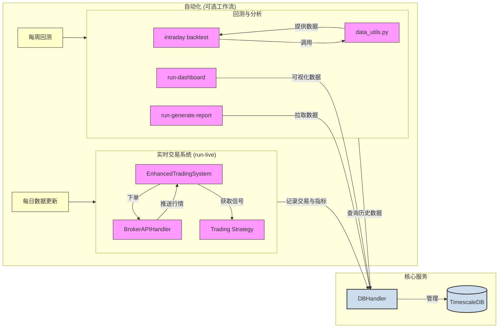

# T+0交易机器人

本项目提供一个可服务器部署的Python自动交易机器人，用于开发、回测与部署算法交易策略。默认采用轻量级的SQLite/Parquet缓存，方便在本地快速迭代；当需要更高性能或横向扩展时，可以通过`config.yml`切换到 TimescaleDB。该项目内置风险管理、绩效分析和Alpaca纸上交易API接入（有利于预演策略的效果）等组件

> ## 注意事项
>
> 1. 最低净值：券商的实盘的日内交易一般都有≥25,000 美元净值的最低资本要求。
>
> 2. 如需更快的日内/高频：尽量用SIP（或更直接的专线）而不是仅 IEX 片段数据，例如Alpaca的免费计划默认IEX，付费可用SIP，而IBKR 上真正高频态势通常意味着FIX/CTCI+专线/机房交叉连接，同时接受每月最低佣金门槛。
>
> 3. 留意相关的风控指标：IBKR 有 OER（提交+修改+撤单 与 成交比）监控，过高会被警告/限流，策略要控制撤单风格。

## 项目设计思路

### 支持服务器端的远程部署值守交易

* 多阶段 Docker 构建：`Dockerfile` 使用 builder/runner 双阶段，先在完整镜像中构建 wheel，再在瘦身镜像中安装产物，默认启动命令即为 `run-live`，从构建到运行全流程封装。

* Compose Profiles 分层：`docker-compose.yml` 将 TimescaleDB 与交易服务分别挂在 `db`、`live` profile 下，既可单独调试数据库，也能一次拉起完整实盘栈；健康检查和依赖顺序都已声明。

* 输出挂载与 .dockerignore：容器默认把 `./output` 映射到 `/app/output`，配合 `.dockerignore` 隔离本地缓存与敏感文件，便于落地部署。

### 可安装的 CLI 与脚本分发

* `pyproject.toml` 声明 `intraday` 顶层命令，并在其下挂载 `backtest run/optimise/benchmark`、`update-data`、`live` 等子命令，安装后即可在任意环境调用。

* `src/intraday_trader_air/cli.py` 提供统一分发器，保持子命令参数和返回码一致，方便在 CI 或调度器中批量调度。

### 数据持久化与配置解耦

* `config.yml` 中的 `database.backend` 支持 `sqlite`、`parquet` 与 `postgresql`，配合 `DBHandler` 可在无需改动代码的情况下切换存储。

* `.env.example`、`.envrc.example` 提供标准化的密钥注入与虚拟环境自动化脚本，支持 `uv`、`pip` 双方案回退。

### 已覆盖的运行场景

| 场景 | 推荐方式 | 说明 |
| --- | --- | --- |
| 本地策略开发 / 快速回测 | 本地虚拟环境 | `uv sync && uv pip install -e .` 后即可使用 CLI，默认包含开发工具链。 |
| 需要 TimescaleDB、长期运行或团队协作 | Docker（`--profile live`） | 容器一次性拉起交易服务与 TimescaleDB，环境完全可复现。 |
| 只想调试数据库或接入 BI 工具 | Docker（`--profile db`） | 单独启动 TimescaleDB，供本地脚本或 BI 工具连接。 |

## 架构总览

整体架构围绕一个中心化的数据层展开，既服务回测又支持实盘。以下流程图展示了各模块之间的交互关系：



## 快速开始

你可以选择使用 Docker（可选，用于可复现/部署）或本地 Python 环境来运行项目。下面分别介绍两种方式的具体步骤，同时提供 `Makefile` 快捷命令。

### 方式一：Docker（按需，可复现/部署用）

1. 克隆仓库

    ```bash
    git clone https://github.com/runchengxie/intraday-trader-air.git
    cd intraday-trader-air
    ```

2. 创建环境变量文件

    ```bash
    cp .env.example .env
    ```

    如果需要 TimescaleDB，请额外在 `.env` 中定义 `POSTGRES_PASSWORD`，并确保密钥不会提交到版本库。

3. 启动服务

    ```bash
    # 等价命令：make docker-live
    docker compose --profile live up trading-bot
    ```

    `--profile live` 会同时拉起交易机器人与 TimescaleDB；若只需要数据库，可执行 `docker compose --profile db up db`。使用 `CTRL+C` 停止服务，或通过 `docker compose down` 清理容器与网络。
    Docker Compose 会自动将数据库连接字段（`DB_BACKEND=postgresql` 以及 `DB_HOST/PORT/USER/PASSWORD/NAME`）注入交易容器，对应的 `config.yml` 会读取这些环境变量完成 TimescaleDB 对接。

### 方式二：本地 Python 环境

1. 创建虚拟环境

    ```bash
    # 推荐使用 uv
    uv venv
    source .venv/bin/activate

    # 或使用标准库 venv
    # python -m venv .venv
    # source .venv/bin/activate
    ```

2. 安装依赖并注册 CLI 命令

    ```bash
    uv sync
    uv pip install -e .
    ```

    `uv sync` 会默认安装 `dev` 依赖组（测试、lint 与 Jupyter 工具）。如果只想安装最小集，可执行 `UV_NO_DEV=1 uv sync --frozen`（或 `uv sync --no-dev --frozen`），再运行 `uv pip install -e .`。默认情况下 `uv` 会忽略当前 shell 已激活的其他虚拟环境并使用项目根目录下的 `.venv`；若确实希望复用已激活环境，可在命令后加上 `--active`。

3. 配置凭证

    将 Alpaca API Key 写入 `.env` 或操作系统的环境变量中：

    ```bash
    export APCA_API_KEY_ID="你的 Key"
    export APCA_API_SECRET_KEY="你的 Secret"
    export ALPACA_BASE_URL="https://paper-api.alpaca.markets"
    ```

4. 运行命令行工具

    * 更新行情数据：`intraday update-data`

    * 回补缺失行情字段：`intraday data backfill --fields trade_count,vwap`

    * 回测策略：`intraday backtest run`

    * 参数优化：`intraday backtest optimise`

    * 基准对比：`intraday backtest benchmark`

    * 生成报表：`intraday generate-report`

    * 启动纸上交易：`intraday live`

    * 启动仪表盘：`intraday dashboard`

   #### 回测/优化常用参数

   * 默认情况下，`run-backtest` 会先运行买入持有基准，再依次执行配置文件中的全部策略。如果希望只测试部分策略，可多次传入 `--strategy`：

    ```bash
    # 在不指定选项的时候将同时完成三个策略和 benchmark 的回测
    run-backtest

    # 只运行 ema_crossover 策略
    run-backtest --strategy ema_crossover

    # 只运行 mean_reversion 策略
    run-backtest --strategy mean_reversion

    # 只运行 custom_ratio 策略
    run-backtest --strategy custom_ratio

    # 指定同时跑多个策略的回测
    run-backtest --strategy ema_crossover --strategy mean_reversion
    ```

* 若只想生成买入持有序列，可使用 `run-backtest benchmark` 或在 `run` 命令中附加 `--no-benchmark` 关闭基准：

    ```bash
     run-backtest --no-benchmark
    ```

* 若希望回测阶段严格要求 `trade_count` 与 `vwap` 均来自数据库缓存，可在 `config.yml` 的 `data.require_full_fields` 字段设置为 `true`。若验证失败，CLI 会提示先执行 `run-backfill` 以补齐历史缺失列。

* `run-backtest optimise` 会读取策略在 `config.yml` 中声明的 `opt_ranges` 网格，并对所选策略逐个搜索。与回测一样，不传 `--strategy` 时会对全部策略执行网格搜索。

* 回测、优化和数据更新命令会将日志写入 `output/logs`，图表输出至 `output/charts`（可在 `config.yml` 的 `paths` 段自定义）。

    若需仪表盘，安装时请带上 `dashboard` 可选依赖：

    ```bash
    uv pip install -e '.[dashboard]'
    # 或
    pip install -e '.[dashboard]'
    ```

### 常用 Make 命令

```bash
make help                # 查看所有常用命令
make sync                # 安装/同步依赖（默认使用项目内 .venv）
make backtest ARGS='…'   # 本地回测，可通过 ARGS 透传 --strategy 等参数
make optimise ARGS='…'   # 仅对选定策略执行参数搜索
make benchmark           # 单独生成买入持有基准
make update              # 更新数据缓存
make fmt                 # 使用 Ruff Formatter 自动格式化
make coverage            # 运行 pytest 并输出覆盖率
make docker-live         # 容器模式启动交易服务 + DB
make docker-db           # 仅启动 TimescaleDB（容器）
```

如需使用当前已激活的虚拟环境运行 `make` 目标，可附加 `USE_ACTIVE=1`：`make backtest USE_ACTIVE=1`。

## CLI 命令手册

| 命令 | 目标 | 关键操作 | 主要产出 |
| --- | --- | --- | --- |
| `update-data` | 获取最新行情并写入缓存/数据库 | 读取 `.env` 中的 Alpaca 密钥，调用 `fetch_historical_data` 并通过 `DBHandler` 写入 TimescaleDB/SQLite | `output/cache/` 下的 Parquet/SQLite 刷新；数据库 K 线数据 |
| `backtest run` | 运行单次回测 | 初始化日志目录、载入策略，生成图表/日志并可写入数据库 | `output/logs/trading_log_*.log`、`output/charts/*.png`、控制台指标汇总 |
| `backtest optimise` | 执行参数优化 | 结合 `strategies.*.opt_ranges` 并行搜索参数组合，输出前十结果 | 控制台排名输出、日志记录 |
| `backtest benchmark` | 仅运行基准 | 运行配置中的基准策略，可选计算含分红总回报 | 基准指标与图表 |
| `generate-report` | 汇总交易日志与绩效快照生成日报 | 从数据库提取 24 小时交易与绩效数据，调用 `PerformanceAnalyzer` 输出报告 | `output/daily_report_YYYYMMDD.json` |
| `live` | 启动纸上交易执行引擎 | 初始化 `EnhancedTradingSystem`、订阅 Alpaca WebSocket、前置风险检查、异步处理订单 | `output/logs/` 中的实时日志、数据库中的交易/绩效快照 |
| `dashboard` | 启动 Streamlit 仪表盘 | 调用 `streamlit run dashboard_app.py` 并监听本地端口 | Web UI（默认 <http://localhost:8501）> |

### 命令详解

* update-data：脚本会先加载 `.env`，然后根据 `config.yml` 中的 `data.ticker` 与时间范围决定拉取的标的与窗口，支持向缓存目录写入 Parquet 文件并通过 `DBHandler.initialize_db()` 创建所需表结构。

* backtest run：除策略回测外，会根据 `config.yml.paths` 自动创建日志、图表、缓存目录，并把运行日志写入 `output/logs/trading_log_*.log`。若配置基准并启用 `benchmark.total_return`，会自动汇总股息到总回报指标。

* backtest optimise：尊重 `backtest.max_cpus` 并行执行参数搜索，输出 `Final Value`、`Sharpe Ratio` 等指标的前十名列表。

* backtest benchmark：只运行基准策略，适合在 CI 中做快速健诊，也可以单独查看含分红/不含分红的收益差异。

* generate-report：默认取最近 24 小时的交易与绩效快照，借助 `PerformanceAnalyzer.generate_performance_report()` 生成 JSON 文档，便于上游任务继续处理或推送。

* live：`EnhancedTradingSystem` 内部组合了 `RiskManager`、`PerformanceAnalyzer`、`ConsistencyValidator` 与 `BrokerAPIHandler`，所有订单在入队前都会通过风险检查；同时支持 `no_fill_test_mode` 进行“不会成交”的联调演练。

* dashboard：如果仓库安装了 `dashboard` 可选依赖，会启动 Streamlit 应用，实时展示数据库中的账户表现与风险指标。

## 配置、环境与密钥管理

* `.env.example` / `.envrc.example`：提供标准化模板，推荐复制后结合 `direnv` 或 `dotenv` 自动注入。`.envrc` 会优先尝试 `uv sync`，失败后再退回 `python -m venv` + `pip install`，并支持 `UV_NO_DEV=1` 禁用开发依赖。

* `config.yml`：支持通过 `${ENV_VAR:-default}` 语法注入环境变量；数据库后端、日志等级、策略参数都集中管理。部署时只需修改配置或环境变量即可切换行情标的、数据库或风控阈值。数据库段默认回落到本地 SQLite，当注入 `DB_BACKEND=postgresql` 时则使用 `DB_HOST/PORT/USER/PASSWORD/NAME` 与 TimescaleDB 建立连接。

* Docker 场景：`docker-compose.yml` 会把主机的环境变量透传给交易容器，并通过卷挂载持久化输出目录；TimescaleDB 密码同样从 `.env` 自动注入。

* 安全提醒：永远不要把密钥写入版本库，可将 `.env`、`.envrc` 保持在本地，同时利用 `.dockerignore` 避免构建镜像时打包敏感文件。

## 风控参数与执行流程

`config.yml` 的 `live_trading.risk_limits` 定义了下单前的硬约束，`RiskManager` 会在行情更新与订单评估时逐项验证：

| 参数 | 含义 | 默认值 |
| --- | --- | --- |
| `max_order_participation_ratio` | 单笔委托不得超过近期成交量的比例，防止过度冲击市场 | 0.02 |
| `max_bid_ask_spread_pct` | 可接受的最大点差百分比，避免在流动性极低时入场 | 0.005 |
| `market_impact_coefficient` | 冲击成本模型系数，用于估计成交滑点 | 0.5 |
| `max_gross_exposure` | 多空绝对敞口占净值的上限 | 1.5 |
| `max_leverage` | 总资产 / 净资产的最大杠杆倍数 | 2.0 |
| `max_var` / `max_concentration` / `min_liquidity` | VaR、单标的集中度与最小流动性门槛 | 0.05 / 0.3 / 1,000,000 |

风控流程简述：行情经 `RiskManager.update_market_data()` 累积历史窗口 → `_perform_risk_checks` 检测价格跳变、量能突增、流动性不足 → 下单前调用 `check_liquidity_and_impact()`、`check_leverage_and_exposure()` 等函数，若超限则返回告警并阻止订单入队。

## 实盘运行与组件职责

`run_live_trading.py` 中的 `EnhancedTradingSystem` 以异步队列为中心组织事件流：

* 数据通路：`BrokerAPIHandler` 订阅行情与订单状态，通过 `asyncio.Queue` 推给策略与风控组件；断线自动重连，并在更新时记录详细日志。

* 风险管理：`RiskManager` 在订单生成前执行流动性、敞口、VaR 等校验；`ConsistencyValidator` 负责检查状态一致性与异常回调。

* 绩效追踪：`PerformanceAnalyzer` 按分钟写入投资组合快照，可配合 `DBHandler.log_performance_snapshot()` 存档，供日报与仪表盘读取。

* 联调模式：`no_fill_test_mode` 允许注入永不成交的测试单（通过价格偏移和自动撤单），用于验证消息流与风控逻辑。

## 自动化调度（可选模板）

仓库未直接附带 GitHub Actions Workflow 文件，但 CLI 已适配批处理场景。你可以基于下表快速创建调度脚本或 Actions 工作流：

| 任务 | 推荐频率 | 命令 | 备注 |
| --- | --- | --- | --- |
| 行情更新 | 每日开盘前 | `intraday update-data` | 需要 Alpaca API 密钥与数据库连接 |
| 回测回归 | 每周或策略改动时 | `intraday backtest run` / `intraday backtest optimise` | 可结合参数优化输出对比图表 |
| 日报生成 | 每日收盘后 | `intraday generate-report` | 产出 JSON，可再由 CI 推送到 S3/钉钉等 |

若在 GitHub Actions 部署，请记得在仓库 Secrets 中配置 Alpaca 凭证与数据库密码。

## Roadmap / 已知局限

* 成交模型待加强：当前冲击成本为静态系数，后续计划引入基于订单簿深度的动态模型。

* 执行算法有限：实盘仅提供均值回归策略，后续会补充 VWAP/TWAP 等算法。

* 回测逼真度：仍待模拟交易所费用、断路器、撮合延迟等细节；当前版本已支持基准含分红收益与 `max_cpus` 自适应，但真实成交建模仍有提升空间。

* 策略扩展：虽有策略注册表，但缺少模板与文档指导多标的、多频率策略的接入。

* 回放测试：目前无历史行情回放的集成测试场景，建议未来补充。

## 项目结构

```tree
.
├── src/intraday_trader_air/   # 核心代码（策略、数据、风险、实盘引擎）
│   └── strategies/               # 策略包（含基类、注册表与具体策略实现）
├── tests/                        # 单元测试与集成测试
├── docs/                         # 文档与设计说明
├── project_tools/                # 开发工具与辅助脚本
├── Makefile                      # 本地与 Docker 工作流统一入口
├── config.yml                    # 全局配置（策略参数、数据源、数据库）
├── docker-compose.yml            # Docker 编排配置
├── Dockerfile                    # 多阶段构建产物镜像
└── pyproject.toml                # 项目依赖与打包信息
```

## 常见问题（FAQ）

1. 一定要用 TimescaleDB 吗？ 不需要。默认使用 SQLite/Parquet 缓存，等需要更长历史或多标的并发查询时，再切换到 TimescaleDB 即可。

2. Alpaca 账号必须是真实资金吗？ 不需要。推荐使用 Alpaca Paper Trading（模拟账户）完成联调。

3. Docker 是必须的吗？ 不是。Docker 仅提供可复现环境，本地虚拟环境照样可以直接运行脚本。

4. 如何扩展新策略？ 在 `src/intraday_trader_air/strategies/` 下新增策略类，并在 `config.yml` 中配置参数，随后在 CLI 中切换使用。

5. 如何切换数据存储后端？ 编辑 `config.yml` 的 `database` 配置块即可。示例：

    * 使用 SQLite：保持默认 `backend: sqlite` 与 `path: output/trading.db`

    * 使用 Parquet：设置 `backend: parquet` 并调整 `path`

    * 使用 TimescaleDB/PostgreSQL：设置 `backend: postgresql`，并通过环境变量或直接在配置中补充 `host/port/user/password/dbname`
