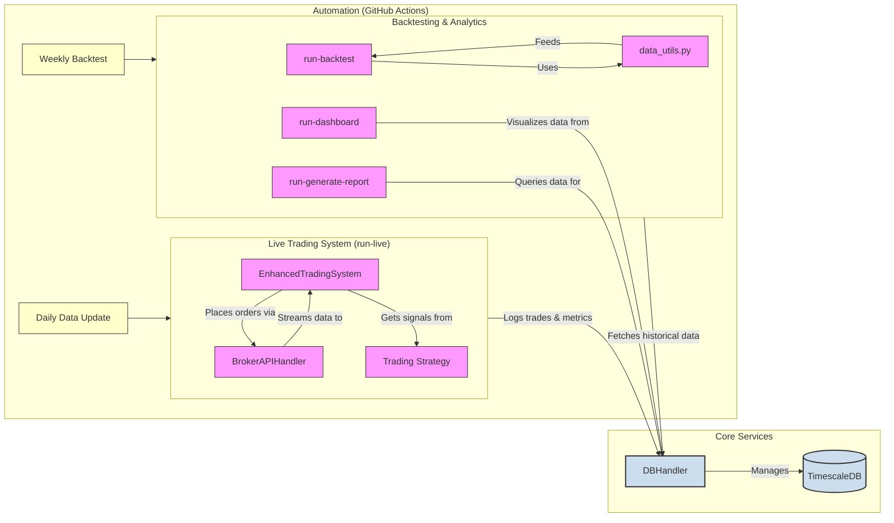

# Python Algorithmic Trading Framework

> [查看中文说明](README.zh.md)

This project is a modern, installable Python framework designed for developing, back-testing, and deploying algorithmic trading strategies. It now defaults to a lightweight SQLite cache for persistence so you can iterate locally without standing up infrastructure, while still providing optional TimescaleDB integration for heavier workloads. The framework includes tools for risk management, performance analysis, and connecting to a paper trading account using the Alpaca API.

The architecture is containerized, automated, and built for durability and performance, making it suitable for both rigorous back-testing and resilient live trading operations.

## Key Features

* **Production-Grade Architecture**: The entire application is containerized with a multi-stage `Dockerfile` and orchestrated via `docker-compose.yml`, ensuring a reproducible and isolated environment for the trading bot and database.

* **Automated CI/CD Workflows**: Includes GitHub Actions for cron-style scheduling of critical tasks, such as daily market data updates and weekly automated back-testing.

* **Installable Package with CLI Tools**: Packaged for easy installation and use with command-line entry points for all major functions (live trading, backtesting, data updates, and reporting).

* **Persistent & Performant Data Layer**: Start with the bundled SQLite-backed cache for a frictionless setup, and graduate to TimescaleDB when you truly need hypertables and horizontal scaling.

* **Flexible Strategy Framework**: Easily define, configure, and switch between multiple trading strategies. The project includes implementations for:
  
  * **Mean-Reversion (Z-Score)**: With optional Kalman Filter for price smoothing.
  
  * **Trend-Following (EMA Crossover)**: With an ADX filter for trend strength confirmation.
  
  * **Momentum (Price/MA Ratio)**: Based on the ratio of current price to a long-term moving average.

* **Advanced Risk Management**: Features a pre-trade risk manager that checks for liquidity constraints, market impact, and exposure limits before an order is placed.

* **Comprehensive Analytics & Reporting**:

  * A powerful backtesting engine leveraging `backtrader` for strategy optimization.

  * An integrated `PerformanceAnalyzer` that reports on P&L, turnover, trading costs, and risk-adjusted returns (Sharpe, Sortino, etc.).

  * An interactive `Streamlit` dashboard for visualizing live performance and risk metrics.

* **Resilient Live Trading**: The live trading engine is built with `asyncio` and a resilient WebSocket reconnection mechanism. It includes a secondary verification loop to ensure the bot's internal state remains synchronized with the broker.

## Project Architecture

The framework is built around a central, persistent data layer that serves both back-testing and live trading systems. The entire ecosystem is designed to be run within a containerized environment, with key operational tasks automated.



## Getting Started

You can run the project using either Docker (recommended for stability and ease of use) or a local Python environment.

### Using Docker (Recommended)

This is the simplest and most reliable way to get the entire system running.

1. **Clone the Repository**:

    ```bash
    git clone https://github.com/runchengxie/algorithmic-trading-framework.git
    cd algorithmic-trading-framework
    ```

2. **Create an Environment File**:

    The system requires API keys and a database password. Create a `.env` file in the project root by copying the example:

    ```bash
    # Create the file (e.g., on Linux/macOS)
    touch .env
    ```

    Now, open the `.env` file and add the following, replacing the placeholder values with your actual credentials. These will be securely passed to the Docker containers.

    ```env
    # --- .env file ---
    # Alpaca Paper Trading API Keys
    APCA_API_KEY_ID="PK..."
    APCA_API_SECRET_KEY="your_secret_key"
    ALPACA_BASE_URL="https://paper-api.alpaca.markets"

    # Database Password (used by both the bot and the database)
    POSTGRES_PASSWORD="your_strong_password_here"
    ```

3. **Build and Run with Docker Compose**:

    This single command will build the trading bot's Docker image, pull the TimescaleDB image, and start both services in the correct order.

    ```bash
    docker-compose up --build
    ```

    The trading bot will start automatically. To stop the services, press `CTRL+C`.

### Local Python Setup

If you prefer to run the application directly on your machine for development:

1. **Create a Virtual Environment**:

    We recommend using `uv` for the fastest setup, but `venv` also works.

    ```bash
    # Using uv (recommended)
    uv venv
    source .venv/bin/activate

    # Or using Python's built-in venv
    # python -m venv venv
    # source venv/bin/activate
    ```

2. **Install Dependencies**:
    Install the project in "editable" mode with all development dependencies.

    ```bash
    # Using uv
    uv pip install -e .[dev]

    # Or using pip
    # pip install -e .[dev]
    ```

3. **Set Up `.env` File**:

    Follow step 2 from the Docker instructions to create and populate your `.env` file. The local scripts will load these variables automatically.

## Usage (Command-Line Tools)

Once installed, the framework provides several command-line scripts for easy operation:

* **Run Live Trading**:

    Starts the live trading bot, which connects to the Alpaca WebSocket stream.

    ```bash
    run-live
    ```

* **Run Backtests & Optimizations**:

    Executes the complete backtesting and strategy optimization process as defined in `config.yml`.

    ```bash
    run-backtest
    ```

* **Update Market Data**:

    Downloads the latest historical data from Alpaca and saves it to your TimescaleDB database.

    ```bash
    run-update-data
    ```

* **Launch Performance Dashboard**:

    Starts an interactive Streamlit web application to visualize performance from the database.

    ```bash
    run-dashboard
    ```

* **Generate a Daily Report**:

    Queries the database for the last day's activity and generates a performance report in JSON format.

    ```bash
    run-generate-report
    ```

## Configuration

The framework's behavior is controlled by two main files:

* **`config.yml`**: This file contains all operational parameters, including data sources, strategy settings, back-testing parameters, and risk limits.

* **`.env`**: This file is used for storing secrets like API keys and database passwords. It is ignored by Git (`.gitignore`) and should **never** be committed to version control.
