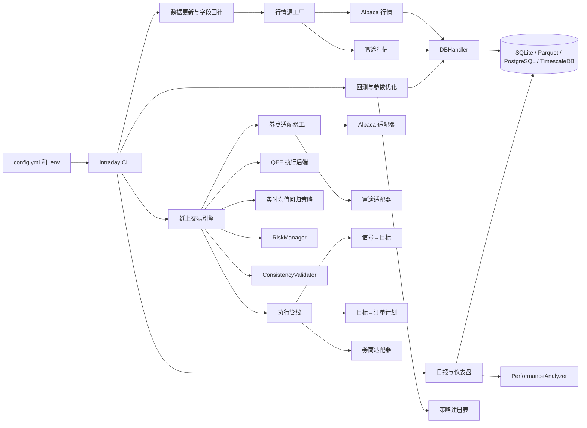

# intraday-trader

基于 Python 3.10 的日内量化交易项目，覆盖策略开发、历史回测、纸上交易接入，以及行情、交易记录和绩效数据的本地与数据库存储。

支持 Alpaca 和富途两个券商通道，以及对应的行情数据源。信号执行管线支持直连券商下单，也支持经由 quant-execution-engine（QEE）的审计化路由。

交易相关代码会直接影响资金安全。实盘前请先在 Alpaca Paper Trading、富途模拟环境或等价模拟环境中验证策略、风控、订单状态同步和异常处理。代码通过测试只说明程序路径可运行，不能说明策略会赚钱。

## 快速开始

### 环境要求

- Python 3.10（`pyproject.toml` 限制为 `>=3.10,<3.11`）
- 推荐使用 `uv` 管理环境
- 默认使用 Alpaca 券商，需要 `APCA_API_KEY_ID`、`APCA_API_SECRET_KEY` 和 `ALPACA_BASE_URL`
- 可选：富途 FutuOpenD 网关（需要 `futu-api`，见下方安装说明）

### 安装

```bash
uv venv && source .venv/bin/activate
uv sync
uv pip install -e .
```

如果只需要运行时依赖：

```bash
UV_NO_DEV=1 uv sync --frozen
uv pip install -e .
```

启用富途券商支持：

```bash
uv pip install -e ".[futu]"
```

启用 QEE 执行路由：

```bash
uv pip install -e ".[qee]"
```

### 配置

```bash
cp .env.example .env
# 填写 Alpaca 密钥（必填）。如使用富途，还需填写 FutuOpenD 连接参数
```

富途相关环境变量：

- `FUTU_HOST`：FutuOpenD 地址，默认 `127.0.0.1`
- `FUTU_PORT`：FutuOpenD 端口，默认 `11111`
- `FUTU_TRD_ENV`：交易环境，`SIMULATE` 或 `REAL`
- `FUTU_MARKET`：市场，`HK`、`US` 或 `CN`
- `FUTU_UNLOCK_PWD`：REAL 模式下的交易解锁密码

### 常用命令

```bash
intraday update-data                           # 拉取行情 + 数据质量检查
intraday backtest run                          # 回测所有已配置策略
intraday backtest run --strategy ema_crossover # 指定策略
intraday backtest optimise                     # 参数网格搜索
intraday data backfill --fields trade_count,vwap
intraday generate-report                       # 生成日报
intraday live                                  # 启动纸上交易
intraday dashboard                             # 启动 Streamlit 仪表盘
```

Docker 运行：

```bash
docker compose --profile live up trading-bot   # 交易机器人 + TimescaleDB
docker compose --profile db up db              # 仅数据库
```

更详细的命令、配置和 Makefile 快捷方式见 `docs/project-manual.md`。

## 架构总览



## 功能概要

- 四类策略：均值回归（Z-Score）、趋势跟随（EMA 交叉 + ADX）、价格比例、买入持有基准
- Backtrader 事件驱动回测，输出夏普比率、最大回撤、VaR、CVaR、换手率等指标
- 三级数据缓存（内存 / SQLite+Parquet / PostgreSQL+TimescaleDB），后端可切换
- 多券商适配层：Alpaca REST + WebSocket 和富途 FutuOpenD，通过统一协议层切换
- 多行情源：Alpaca 和富途 FutuOpenD 历史 K 线，通过统一工厂接入
- 执行管线：信号 → 持仓目标 → 订单计划 → 券商下单，含整数手数处理和限价偏移
- QEE 执行路由：可将信号导出为标准 `targets.json`，经由 quant-execution-engine 审计化执行
- 风控检查、异常处理和一致性验证
- Streamlit 仪表盘和每日绩效报告
- Docker Compose 部署，Makefile 快捷命令

完整能力清单和已知局限见 `docs/project-manual.md`。

## 文档导航

| 文件 | 内容 | 适合 |
| --- | --- | --- |
| `README.md`（本文件） | 项目概貌和快速开始 | 第一次接触项目 |
| `AGENTS.md` | 协作规范、代码风格、测试要求 | 准备提交代码 |
| `docs/project-manual.md` | 完整能力清单、配置参考、CLI 详解、测试指南、已知技术债 | 深入了解和日常开发 |
| `docs/design-rationale.md` | 策略选型、风控模型、绩效评估和多券商设计思路 | 理解设计考量 |

## 项目结构

```tree
.
├── src/intraday_trader/      # 核心代码
│   ├── analytics/                # 独立指标计算（风险、成本、换手率、相对表现）
│   ├── backtest/                 # 回测请求对象与执行入口
│   ├── brokers/                  # 多券商适配层（Alpaca + 富途，统一协议）
│   ├── data_providers/           # 多行情源（Alpaca + 富途，统一协议）
│   ├── execution/                # 执行管线（信号→目标→订单计划→下单）
│   ├── live/                     # 实盘会话编排
│   ├── scripts/                  # CLI 子命令实现
│   ├── storage/                  # ORM 模型与 Parquet 存储
│   └── strategies/               # 策略基类、注册表和内置策略
├── tests/                        # 单元测试、集成测试和端到端测试
├── docs/                         # 项目说明书、设计思路
├── project_tools/                # 开发辅助脚本
├── Makefile                      # 本地和 Docker 常用任务
├── config.yml                    # 全局配置
├── docker-compose.yml            # Docker Compose 服务定义
├── Dockerfile                    # 多阶段镜像构建
└── pyproject.toml                # 依赖、打包和工具配置
```

## 常见问题

**一定要用 TimescaleDB 吗？**

不需要。默认配置使用 SQLite，本地快速试验足够。需要更长历史、多进程读写或团队共享时，再切换到 PostgreSQL/TimescaleDB。

**Alpaca 账号必须绑定真实资金吗？**

不需要。推荐先使用 Alpaca Paper Trading 完成策略、风控和订单状态联调。

**富途 FutuOpenD 可以用真实账户吗？**

可以，但不推荐在联调阶段使用。先在模拟环境（`FUTU_TRD_ENV=SIMULATE`）中验证策略和风控逻辑，确认无误后再切换到真实环境。真实环境需要设置 `FUTU_UNLOCK_PWD` 交易密码。

**Docker 是强制要求吗？**

不强制。Docker 提供可复现运行环境，本地虚拟环境也可以运行同一套 CLI。

**如何扩展新策略？**

在 `src/intraday_trader/strategies/` 中新增策略类，把类加入 `REGISTRY`，再在 `config.yml` 的 `strategies` 段配置参数和优化网格。

**如何切换券商？**

修改 `config.yml` 的 `live_trading.broker.name`，可选值为 `alpaca` 和 `futu`。使用富途时需同时配置 `market`、`host`、`port` 和 `mode` 参数。

**如何切换行情源？**

修改 `config.yml` 的 `data.provider.name`，可选值为 `alpaca` 和 `futu`。使用富途时需同时配置 `market`、`host`、`port`。

**如何切换数据存储后端？**

修改 `config.yml` 的 `database.backend`，可选值为 `sqlite`、`parquet` 和 `postgresql`。使用 PostgreSQL 时需同时提供 `host`、`port`、`user`、`password` 和 `dbname`。
