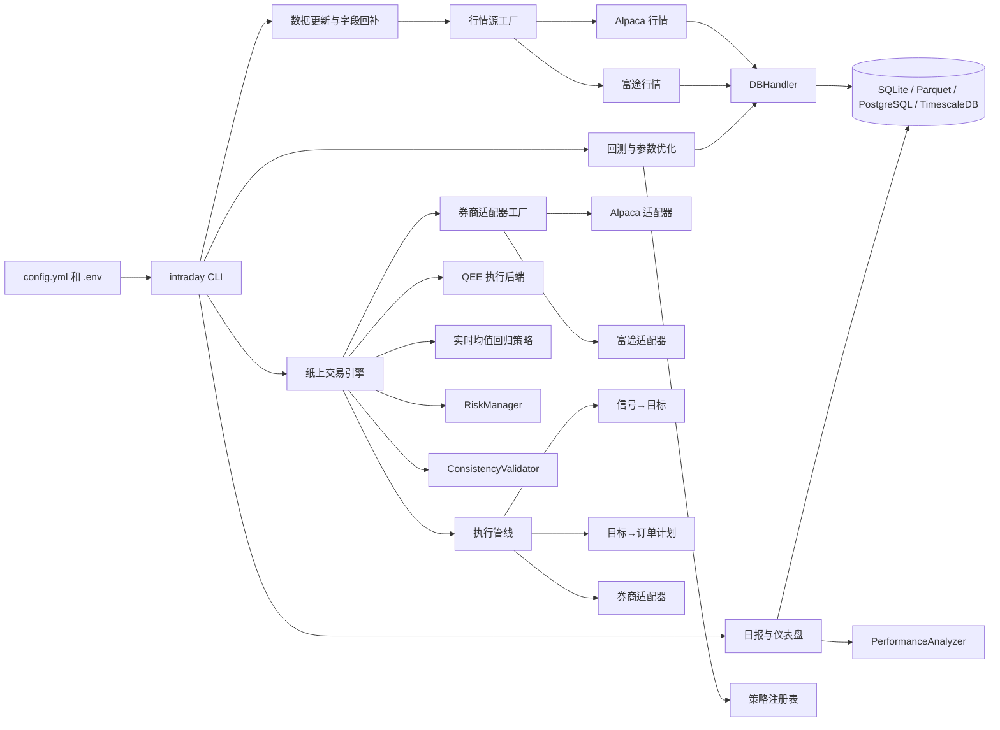

# 项目说明书

本文是 intraday-trader 的项目说明书，面向新接手项目的开发者。内容包括能力清单、配置参考、CLI 命令详解、测试指南和已知技术债。

阅读顺序建议：先看根目录 `README.md` 了解项目概貌和快速开始，再回到本文深入细节。

## 能力清单

### 策略

- 三类内置策略：`MeanReversionZScoreStrategy`、`EMACrossoverStrategy`、`CustomRatioStrategy`。
- 一类基准：`BuyAndHoldStrategy`。
- 策略注册表支持 `config.yml` 驱动，无需改代码即可切换和配置策略。
- 均值回归策略支持 `filtered_close` 输入和限价单参数。
- EMA 交叉策略支持 ADX 过滤和移动止损。
- 参数优化支持网格搜索和并行执行。

### 券商

- 多券商适配层，通过统一 `BrokerAdapter` 协议切换。
- Alpaca：REST 下单、账户查询、持仓查询、订单状态查询；WebSocket 行情和订单更新订阅。
- 富途 FutuOpenD：支持港股（HK）、美股（US）、A 股（CN）市场；支持模拟（SIMULATE）和真实（REAL）交易环境；REST 风格下单、账户查询、持仓查询、订单状态查询、批量撤单。
- 富途适配器当前阶段为 REST 轮询模式，不包含 WebSocket 实时推送。

### 行情源

- 多行情源适配层，通过统一 `MarketDataProvider` 协议切换。
- Alpaca：历史分钟线和日线 K 线。
- 富途 FutuOpenD：历史 1/5/15/30/60 分钟和日线 K 线。

### 数据

- 多级缓存：内存、本地 Parquet/SQLite、远程 PostgreSQL/TimescaleDB。
- `DBHandler` 支持 `sqlite`、`parquet`、`postgresql` 三种后端，PostgreSQL 下自动创建 hypertable。
- `intraday data backfill` 回补 `trade_count` 和 `vwap` 字段。
- 降级估算：缺 `trade_count`/`vwap` 时回测可自动估算，也可设置 `require_full_fields` 强制拒绝。
- 数据质量检查：时间戳单调性、缺失 bar、空值、价格跳变。

### 回测

- 基于 Backtrader 的事件驱动回测。
- 统一入口 `intraday_trader.backtest.engine.run_backtest()`。
- 输出指标：最终资产、交易次数、胜率、净利润、夏普比率、最大回撤、年化收益、VaR、CVaR、换手率。
- 含股息总回报基准。

### 实盘联调

- `asyncio.Queue` 事件循环处理 trade、bar、订单更新。
- `RiskManager` 检查 VaR、流动性、点差、市场冲击、杠杆、敞口、价格跳变、成交量异常。
- `ExceptionHandler` 重试和熔断。
- `ConsistencyValidator` 信号、成交、绩效一致性检查。
- `no_fill_test_mode` 测试单和自动撤单。
- `PerformanceAnalyzer` 风控指标、交易成本、换手率、集中度、相对基准表现。

### 执行管线

- 信号到券商下单的完整管线：信号 → 持仓目标（`SignalTarget`）→ 订单计划（`OrderPlanEntry`）→ 券商适配器下单。
- 订单计划阶段处理整数手数取整和非美股市场的 lot size。
- 支持限价单偏移（买价上浮、卖价下浮）和测试模式安全边距。

### QEE 执行路由

- 可选经由 `quant-execution-engine`（QEE）执行信号。
- 信号转为标准 `targets.json`，导出审计化 lineage 文件。
- 支持 dry-run 模式（只计划不下单）和实盘提交模式。

### 仪表盘

- Streamlit 应用从数据库读取交易日志和绩效快照并展示。

### 基础设施

- 统一 CLI 入口 `intraday`，支持 `backtest run/optimise/optimize/benchmark`、`data backfill`、`update-data`、`generate-report`、`live`、`dashboard`。
- 多阶段 Docker 镜像构建。
- Docker Compose profiles：`live`（交易机器人 + TimescaleDB）和 `db`（仅数据库）。
- Makefile 快捷命令。
- Ruff 格式化和 lint。
- Python 3.10 锁定，`pyproject.toml` 限制 `<3.11`。

## 架构总览



## 项目结构

```tree
.
├── src/intraday_trader/      # 核心代码
│   ├── analytics/                # 独立指标计算（风险、成本、换手率、相对表现）
│   ├── backtest/                 # 回测请求对象与执行入口
│   ├── brokers/                  # 多券商适配层（Alpaca + 富途，统一协议）
│   ├── data_providers/           # 多行情源（Alpaca + 富途，统一协议）
│   ├── execution/                # 执行管线（信号→目标→订单计划→下单）
│   ├── live/                     # 实盘会话编排
│   ├── scripts/                  # CLI 子命令实现
│   ├── storage/                  # ORM 模型与 Parquet 存储
│   └── strategies/               # 策略基类、注册表和内置策略
├── tests/                        # 单元测试、集成测试和端到端测试
├── docs/                         # 项目说明书、设计思路
├── project_tools/                # 开发辅助脚本
├── Makefile                      # 本地和 Docker 常用任务
├── config.yml                    # 全局配置
├── docker-compose.yml            # Docker Compose 服务定义
├── Dockerfile                    # 多阶段镜像构建
└── pyproject.toml                # 依赖、打包和工具配置
```

## 配置文件参考

`config.yml` 是主要配置入口，各段职责如下：

| 配置段 | 职责 |
| --- | --- |
| `alpaca` | 从环境变量读取 API 密钥和接口地址 |
| `data` | 标的、回测时间范围、K 线周期、复权方式、字段完整性要求、行情源 |
| `data.provider` | 行情源选择（`name` 可选 `alpaca` 或 `futu`），富途时额外指定 `host`、`port`、`market` |
| `paths` | 输出、日志、图表和缓存目录 |
| `benchmark` | 买入持有基准和股息总回报开关 |
| `database` | 存储后端选择（`sqlite`、`parquet`、`postgresql`） |
| `backtest` | 初始资金、佣金、滑点和最大 CPU 数 |
| `strategies` | 策略类、参数、优化网格和订单参数 |
| `live_trading` | 纸上交易标的、初始资金、券商选择、执行后端和风控阈值 |
| `live_trading.broker` | 券商选择（`name` 可选 `alpaca` 或 `futu`），富途时额外指定 `market`、`host`、`port`、`mode` |
| `live_trading.execution` | 执行后端：`backend: direct`（直连券商）或 `backend: qee`（经由 QEE） |
| `live_trading.execution.qee` | QEE 参数：`broker_name`、`dry_run`、`target_output_dir`、`allow_short`、`order_qty` |
| `logging` | 日志等级、格式和时间格式 |

环境变量支持 `${ENV_VAR:-default}` 形式。通用配置加载器 `intraday_trader.configuration.load_app_config()` 已支持默认值替换。

已知问题：`run_live_trading.py` 内部还有一个旧版 YAML 加载函数，默认值替换能力较弱，后续应统一到通用配置加载器。

## 风控参数

`config.yml` 的 `live_trading.risk_limits` 定义下单前的限制：

| 参数 | 含义 | 默认值 |
| --- | --- | --- |
| `max_order_participation_ratio` | 单笔订单占近期成交量的上限 | 0.02 |
| `max_bid_ask_spread_pct` | 可接受的最大买卖价差比例 | 0.005 |
| `market_impact_coefficient` | 估算市场冲击成本的系数 | 0.5 |
| `max_gross_exposure` | 多空绝对敞口相对净值的上限 | 1.5 |
| `max_leverage` | 总资产相对净资产的最大倍数 | 2.0 |
| `max_var` | VaR 上限 | 0.05 |
| `max_concentration` | 单标的集中度上限 | 0.3 |
| `min_liquidity` | 最低流动性门槛 | 1,000,000 |

基本流程：行情进入 `RiskManager.update_market_data()` 后，系统检查价格跳变、成交量异常和流动性风险。下单前再调用 `check_liquidity_and_impact()` 与 `check_leverage_and_exposure()`，超限时阻止订单继续执行。

## CLI 命令详解

| 命令 | 用途 | 主要产出 |
| --- | --- | --- |
| `intraday update-data` | 拉取配置标的前一日分钟线，写入缓存和数据库，并运行数据质量检查 | `output/cache/`、`output/data_qc_*.json`、数据库行情表 |
| `intraday data backfill` | 按配置日期范围或命令行参数，回补 `trade_count`、`vwap` 等行情字段 | 更新后的 `market_data` |
| `intraday backtest run` | 运行买入持有基准和选定策略的单次回测 | 控制台指标、`output/logs/`、`output/charts/` |
| `intraday backtest optimise` | 按 `opt_ranges` 搜索策略参数 | 控制台前十名参数组合和日志 |
| `intraday backtest benchmark` | 只运行配置中的买入持有基准 | 基准指标和图表 |
| `intraday generate-report` | 汇总最近 24 小时的交易日志和绩效快照 | `output/daily_report_YYYYMMDD.json` |
| `intraday live` | 启动纸上/模拟交易事件循环 | 实时日志和订单状态处理 |
| `intraday dashboard` | 启动 Streamlit 仪表盘 | 默认本地 Web 页面：http://localhost:8501 |

`optimise` 和 `optimize` 都可以使用，二者指向同一个参数优化入口。旧脚本入口仍然保留（`run-backtest`、`run-live` 等），但新文档统一推荐使用 `intraday` 顶层命令。

## Makefile 快捷命令

```bash
make help
make sync
make backtest ARGS='--strategy ema_crossover'
make optimise ARGS='--strategy mean_reversion'
make benchmark
make update
make live
make dashboard
make lint
make fmt
make coverage
make docker-build
make docker-live
make docker-db
```

如需使用当前已激活的虚拟环境运行 `make` 目标，追加 `USE_ACTIVE=1`：

```bash
make backtest USE_ACTIVE=1 ARGS='--strategy ema_crossover'
```

## 测试指南

### 环境准备

```bash
uv sync
uv pip install -e .
```

### 常用命令

```bash
uv run pytest                        # 全部测试
uv run pytest -m 'not integration'   # 跳过集成测试
uv run pytest -m integration         # 仅集成测试
make coverage                        # 覆盖率报告
```

### 测试目录结构

- `tests/unit/`：配置、数据质量、存储、风控、绩效分析、策略和实盘组件的单元测试
- `tests/integration/`：Alpaca 与数据库集成测试，需要外部服务或凭证
- `tests/e2e/`：回测工作流端到端测试
- `tests/conftest.py`：公共 fixture，包括临时输出目录、配置对象、Alpaca stub 和轻量版 `mocker`

当前测试脚本使用 `pytest.importorskip` 跳过缺失依赖的部分用例。集成测试会检查 Alpaca 凭证。若在非 Python 3.10 或未安装依赖的环境中直接运行，测试结果只能说明当前环境不完整。

### 单元测试覆盖

| 文件 | 覆盖内容 |
| --- | --- |
| `test_configuration.py` | 配置加载、字段校验、时间窗错误处理 |
| `test_strategies.py` | EMA 交叉信号、均值回归信号、Ratio 策略信号、过滤器、限价单参数 |
| `test_data_quality.py` | 时间戳检查、缺失 bar、空值、价格跳变、报告生成 |
| `test_db_handler_storage.py` | SQLite 读写、Parquet 读写、upsert 去重、Parquet 引擎降级跳过 |
| `test_risk_manager.py` | VaR、流动性、点差、市场冲击、杠杆、敞口、价格跳变、成交量异常 |
| `test_performance_analyzer.py` | 收益计算、风险指标、交易成本、换手率、报告生成、图表输出 |
| `test_exception_handler.py` | 重试、熔断、错误分类和严重等级 |
| `test_broker_handler.py` | 下单、API 错误处理、账户查询 |
| `test_live_system.py` | 交易循环、信号路由到订单执行 |
| `test_cli.py` | CLI 命令解析、未知命令报错、帮助输出 |

### 集成测试覆盖

| 文件 | 覆盖内容 |
| --- | --- |
| `test_db_integration.py` | 数据库连接、表创建、hypertable 验证、数据读写、upsert、交易日志、绩效快照 |
| `test_broker_integration.py` | Alpaca REST 连接、行情获取、订单提交 |

### 端到端测试覆盖

| 文件 | 覆盖内容 |
| --- | --- |
| `test_backtest_workflow.py` | 策略加载、数据馈送、回测执行、结果验证的完整链路 |

### 已知测试覆盖缺口

- `brokers/`（Alpaca 和富途适配器）没有独立测试
- `data_providers/`（Alpaca 和富途行情源）没有独立测试
- `execution/`（信号→目标→订单计划→下单管线）没有独立测试
- `qee_execution_backend.py` 和 `qee_target_exporter.py` 没有独立测试
- `consistency_validator.py` 没有独立单元测试
- `dashboard_app.py` 没有自动化测试
- `plotting.py` 没有自动化测试
- `scripts/run_backfill_data.py` 没有独立测试，只通过 CLI 间接验证
- Docker 容器内测试尚未建立

## 已知技术债

### 需要修复的问题

1. `intraday live` 命令行入口没有创建并传入 `DBHandler`，实盘快照默认不写入数据库
2. `EnhancedTradingSystem.stop_trading()` 调用了尚未实现的 `generate_comprehensive_report()`
3. `start_live_trading()` 中存在重复的初始账户和持仓刷新逻辑
4. `run_live_trading.py` 内部有一个旧版 YAML 加载函数，比 `configuration.py` 的 `load_app_config()` 弱，需要统一

### 未覆盖的真实交易细节

- 多标的组合
- 交易所撮合延迟和订单簿深度
- 真实交易费用（SEC 费用、交易所费用）
- 断路器
- 历史行情回放测试

### 架构层面待改进

- 策略注册表目前只支持单标的策略，多标的策略需要扩展
- 因子归因（滚动 beta、信息比率、多因子回归）尚未内置
- 富途适配器当前为 REST 轮询模式，未接入 WebSocket 实时推送
- 新模块（`brokers/`、`data_providers/`、`execution/`、QEE 后端）缺少测试覆盖

## 变更记录

- 2026-06-22：文档全面更新。README、AGENTS.md、project-manual 反映多券商适配层（Alpaca + 富途）、多行情源层、执行管线（信号→目标→订单计划→下单）、QEE 执行路由、storage/analytics/live 模块拆分等新增能力。新增 `.env.example` 富途环境变量。
- 2026-06-21：文档全面中文化，README、AGENTS.md、docs/ 全部翻译并整理。cli.py 重构为显式命令解析。新增 test_cli.py。修复 test_live_system.py 和 test_db_handler_storage.py 的 importorskip 缺失。
