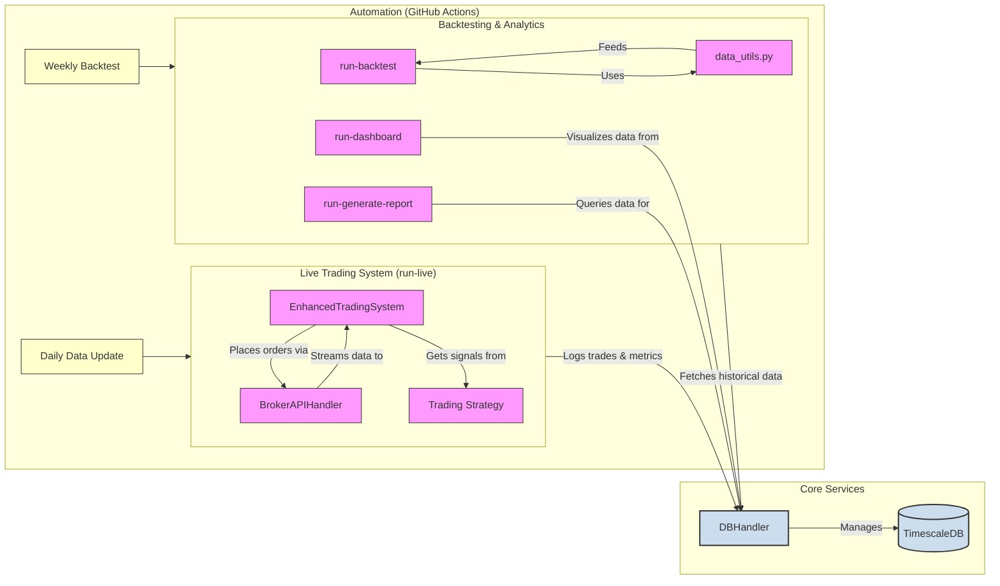

# Architectural Flowchart

```mermaid
flowchart LR
    subgraph Core_Services["Core Services"]
        direction LR
        DB_Handler[DBHandler]
        Database[(TimescaleDB)]
        DB_Handler -- "Manages" --> Database
    end

    subgraph Live_Trading["Live Trading System (run-live)"]
        direction TB
        ETS[EnhancedTradingSystem]
        Broker[BrokerAPIHandler]
        Strat[Trading Strategy]

        ETS -- "Places orders via" --> Broker
        Broker -- "Streams data to" --> ETS
        ETS -- "Gets signals from" --> Strat
    end

    subgraph Backtest_and_Analytics["Backtesting & Analytics"]
        direction TB
        BacktestScript[run-backtest]
        ReportScript[run-generate-report]
        DashboardScript[run-dashboard]
        Data_Utils[data_utils.py]

        BacktestScript -- "Uses" --> Data_Utils
        Data_Utils -- "Feeds" --> BacktestScript
    end

    subgraph Automation["Automation (GitHub Actions)"]
        direction TB
        Cron_Data[Daily Data Update]
        Cron_Backtest[Weekly Backtest]

        Cron_Data --> Live_Trading
        Cron_Backtest --> Backtest_and_Analytics
    end

    Live_Trading -- "Logs trades & metrics" --> DB_Handler
    Backtest_and_Analytics -- "Fetches historical data" --> DB_Handler
    ReportScript -- "Queries data for" --> DB_Handler
    DashboardScript -- "Visualizes data from" --> DB_Handler

    classDef core fill:#f9f,stroke:#333,stroke-width:1px;
    classDef db fill:#cde,stroke:#333,stroke-width:2px;
    classDef automation fill:#ffc,stroke:#333,stroke-width:1px;
    class ETS,Broker,Strat,BacktestScript,ReportScript,DashboardScript,Data_Utils core;
    class DB_Handler,Database db;
    class Cron_Data,Cron_Backtest automation;
```
